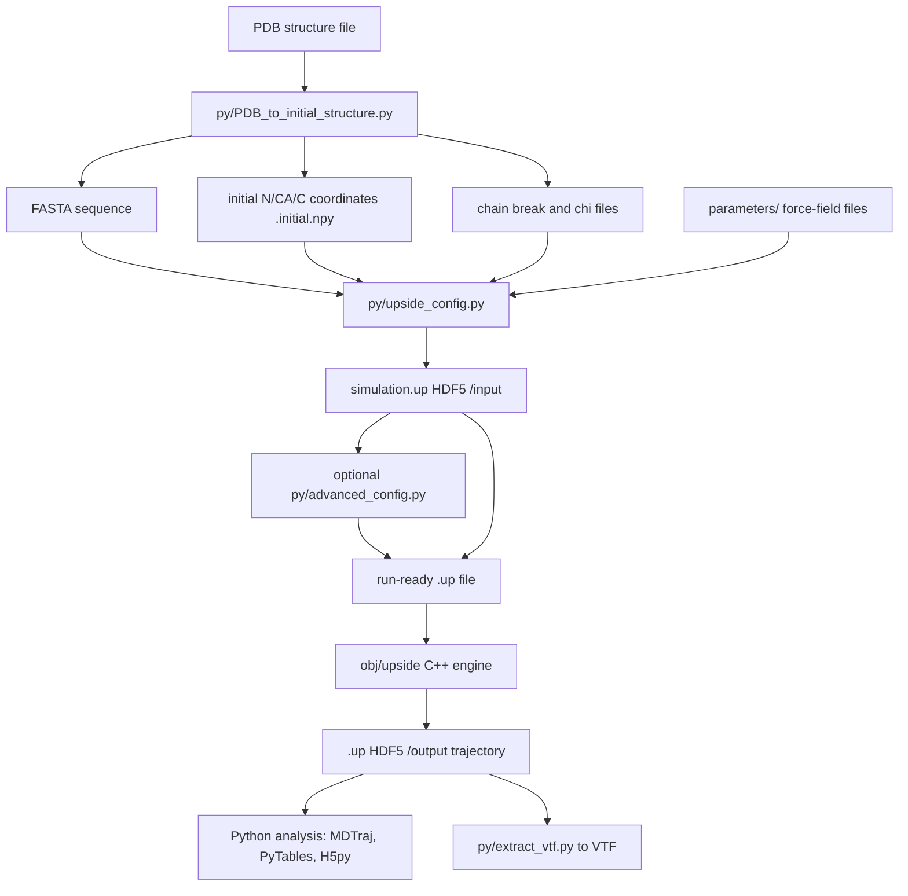
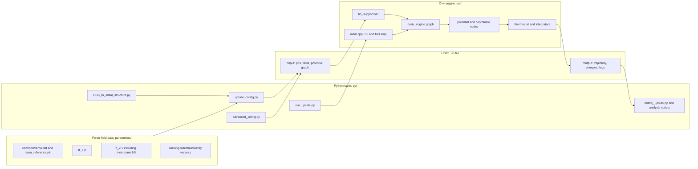
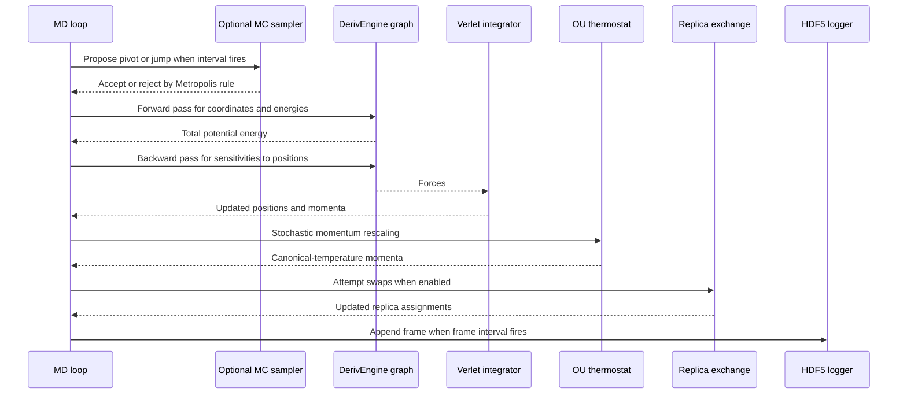

# Repository Report: Upside Coarse-Grained Protein MD

This repository is an Upside coarse-grained molecular dynamics codebase for protein simulations. It combines a C++ simulation engine, a Python configuration and analysis layer, HDF5 `.up` simulation files, force-field parameter bundles, and worked scientific examples that demonstrate installation checks, replica exchange, trajectory analysis, HDX prediction, restraints, membrane simulations, pulling, restart behavior, proline isomerization, large systems, and specialized integrator/configuration features.

The report is intentionally a single Markdown file. Diagrams are embedded as Mermaid blocks so they can be rendered by a Markdown viewer without sidecar image files.

## At a Glance: What This Repository Is

| Layer | Repository paths | Role |
|---|---|---|
| C++ simulation engine | `src/`, built into `obj/upside` and `obj/libupside.so` | Runs MD, replica exchange, Monte Carlo moves, thermostats, logging, and force evaluations. |
| Python workflow layer | `py/` | Converts PDBs, builds `.up` configuration files, adds advanced restraints, launches runs, loads trajectories, and performs analyses. |
| Force-field parameters | `parameters/` | Stores Ramachandran, hydrogen-bond, rotamer, burial, membrane, and packing/cavity data. |
| Worked examples | `example/` | Provides reproducible scripts for common and specialized Upside workflows. |
| Documentation | `README.md`, `ARCHITECTURE.md`, `DATAFLOW.md` | Explains installation, execution, architecture, HDF5 layout, and data flow. |

Upside represents each residue with coarse-grained backbone atoms and virtual side-chain/interaction sites. Python scripts convert biological input data into a self-contained HDF5 `.up` file. The C++ executable reads the `.up` file, constructs a derivative graph from `/input/potential/`, runs dynamics, and appends trajectory data under `/output/`.

## At a Glance: Every Example

| Example | Primary purpose | Main scripts and inputs | Scientific or workflow idea |
|---|---|---|---|
| `example/00.AnalysisScripts` | Maintained HDX/HX-MS analysis workflow | `analysis.sh`, `0.run_HXMS.py` through `6.generate_hx_plots.py`, `helpers/` | Compare simulated protection/deuterium uptake behavior against HX-MS-style experimental data. |
| `example/01.GettingStarted` | Installation and basic run sanity check | `0.run.py`, `0.run.sh`, `1.ana.sh`, `pdb/chig.pdb`, `pdb/1dfn.pdb` | Convert PDB to Upside input, run a simple trajectory, convert to VTF/MDTraj-readable data. |
| `example/02.ReplicaExchangeSimulation` | Replica exchange and restart pattern | `run.py`, `SLURMs/run_SLURM.py`, `pdb/chig.pdb` | Sample across temperatures and continue from previous trajectory state. |
| `example/03.TrajectoryAnalysis` | Standard trajectory analysis | `0.run.py`, `1.traj_ana.sh`, `2.mbar_meltingCurve_freeEnergy.py` | RMSD, potential energy, radius of gyration, hydrogen bonds, temperature, and MBAR reweighting. |
| `example/04.HDX` | HDX prediction from REMD trajectories | `0.run.py`, `1.config.py`, `2.traj_ana.sh`, `3.get_protaction_states.sh`, `4.calc_HDX.py` | Estimate protection states, HDX free energies, and denaturant dependence from simulation. |
| `example/05.Advanced_config.py` | Advanced configuration and residue restraints | `0.run.py`, `0.run.sh`, `1.ana.sh` | Use `run_upside.advanced_config()` to add restraint groups and spring constants. |
| `example/06.PullingSimulation` | AFM-like pulling simulation | `0.run.py`, `1.get_force.py`, `1qhj_AFM.dat` | Generate force-extension data for pulling dynamics, including membrane-protein pulling. |
| `example/07.MoreRestraints` | Restraint variations | `0.run.py`, `genUp.py`, wall/spring/nail `.dat` files | Demonstrate fixed and pair walls, springs, nails, and related custom constraints. |
| `example/08.MembraneSimulation` | Implicit membrane workflows | `0.normal.run.py` through `5.curvature_dynamics2.run.py`, `lateral.dat`, nail files | Membrane insertion potential, channel setup, lateral pressure, fixed curvature, and dynamic curvature. |
| `example/09.IsomerizationPRO` | Proline trans/cis isomerization | `0.run.py`, `trans_cis.dat`, `recal_omega.py`, `recal_potential.py`, `plot_two_wall.py` | Add proline isomerization terms and inspect omega-angle potential behavior. |
| `example/10.SelfAvoidRandomWalk` | Fast self-avoiding/random-walk-style polymer run | `run.py`, `SLURMs/run_SLURM.py`, `pdb/1ubq.pdb` | Remove expensive forces to explore faster polymer-like sampling. |
| `example/11.BigSystem` | Large FASTA-only system and memory behavior | `0.run.py`, `1.ana.sh`, `fasta/S10000.fasta` | Exercise Upside on a large sequence and inspect runtime/memory behavior. |
| `example/12.MultistepIntegrator` | Multi-step Verlet integrator | `0.run.py`, `1.ana.sh` | Use `--integrator mv` and `--inner-step` for multi-step integration. |
| `example/13.RestartSimulation` | Proper restart with recorded momenta | `0.run.py`, `0.continue.py`, `README.md` | Record momenta, copy final position/momentum into input, and continue with `--restart-using-momentum`. |
| `example/15.SpatialTransformation` | Spatial transform table workflow | `0.run.py`, `0.run.sh`, `1.ana.sh`, `spatial_table` | Configure a run using `spatial_transform_from_table`. |

## At a Glance: Core Scientific Concepts

| Concept | Where it appears | Why it matters |
|---|---|---|
| Coarse-grained molecular dynamics | Whole repository | Reduces atomistic detail so protein conformational sampling can be faster than all-atom MD. |
| Ramachandran backbone statistics | `parameters/common/rama.dat`, `src/rama_map_pot.cpp` | Encodes favorable backbone dihedral regions for protein structure. |
| Rotamer side-chain modeling | `parameters/ff_2.*/sidechain.h5`, `src/rotamer.cpp` | Represents side-chain conformational states without explicit all-atom dynamics. |
| Hydrogen bonding | `parameters/ff_2.*/hbond.h5`, `src/hbond.cpp` | Captures directional backbone interactions important for secondary structure. |
| Burial/environment terms | `environment.h5`, `bb_env.dat`, `src/environment.cpp` | Scores residue exposure and packing context. |
| Replica exchange | `src/main.cpp`, examples 02-04 and 10 | Improves sampling by swapping configurations across temperatures or Hamiltonians. |
| MBAR | `example/03.TrajectoryAnalysis/2.mbar_meltingCurve_freeEnergy.py`, `example/04.HDX/4.calc_HDX.py` | Reweights simulation ensembles to estimate thermodynamic curves. |
| HDX/HX-MS | examples 00 and 04 | Connects simulated protection states to experimental exchange measurements. |
| Implicit membrane | `parameters/ff_2.1/membrane.h5`, `src/membrane_potential.cpp`, example 08 | Models membrane-protein energetics without explicit lipids. |
| AFM pulling | `src/tension.cpp`, example 06 | Simulates force-extension behavior under mechanical perturbation. |
| Verlet and multi-step Verlet | `src/main.cpp`, example 12 | Integrates molecular motion through time. |
| Ornstein-Uhlenbeck thermostat | `src/thermostat.cpp`, `src/thermostat.h` | Maintains canonical-temperature momentum statistics. |
| Proline cis/trans isomerization | example 09 | Models slow peptide-bond isomerization around proline residues. |

## At a Glance: Tools, Files, and Data Products

| File or product | Format | Producer | Consumer |
|---|---|---|---|
| `.pdb` | Protein Data Bank text | External structure source or example input | `py/PDB_to_initial_structure.py` |
| `.fasta` | Plain text sequence | `py/PDB_to_initial_structure.py` or hand-authored examples | `py/upside_config.py` |
| `.initial.npy` | NumPy coordinate array | `py/PDB_to_initial_structure.py` | `py/upside_config.py` |
| `.chain_breaks` | Text indices | `py/PDB_to_initial_structure.py` | `py/upside_config.py` |
| `.chi` | Text side-chain angle table | `py/PDB_to_initial_structure.py` | Optional side-chain workflows |
| `.up` | HDF5 | `py/upside_config.py` and `obj/upside` | `obj/upside`, `py/mdtraj_upside.py`, PyTables/H5py analysis |
| `.h5` parameter files | HDF5 | Force-field parameterization | `py/upside_config.py`, C++ engine after config embedding |
| `.dat` parameter/control files | Text tables | Examples and parameter data | `py/upside_config.py`, `py/advanced_config.py` |
| `.vtf` | VMD trajectory text | `py/extract_vtf.py` | VMD and compatible viewers |
| `.log` | Text | Run scripts and `obj/upside` | Human inspection and cluster monitoring |

## How to View the Rendered Diagrams on Linux

This report is valid Markdown even when diagrams are shown as source code. To render the Mermaid diagrams on Linux:

| Option | How to use it | Notes |
|---|---|---|
| VS Code or VSCodium | Install a Mermaid-capable Markdown preview extension such as "Markdown Preview Mermaid Support", then open `REPOSITORY_REPORT.md` and use Markdown preview. | Good for local repository browsing. |
| Obsidian | Open this repository or the report file as a vault/note. | Obsidian renders Mermaid blocks in preview mode. |
| MarkText | Open `REPOSITORY_REPORT.md` in MarkText and switch to rendered Markdown view. | Useful as a dedicated Markdown editor. |
| Mermaid CLI | Install Node.js/npm, then run `npx @mermaid-js/mermaid-cli -i diagram.mmd -o diagram.svg` for extracted Mermaid snippets. | Best when exporting diagrams to SVG/PNG is needed. |
| GitHub or GitLab | Push the report to a repository and view it in the web UI. | Both commonly render Mermaid code fences in Markdown views. |

For command-line export, copy a single Mermaid block into a file such as `pipeline.mmd` and render it with Mermaid CLI. The report itself deliberately keeps diagrams inline instead of checking in generated images.

## How Upside Works End to End



The `.up` file is the central artifact. Before a run, it contains `/input`: starting coordinates, sequence information, and a serialized potential graph. During a run, `obj/upside` appends `/output`: positions, energies, time, temperatures, replica-index data when enabled, and optional detailed logs such as hydrogen-bond or rotamer-state datasets.

## Detailed Example Guide

### `example/00.AnalysisScripts`

This directory contains the maintained HDX/HX-MS analysis workflow. `analysis.sh` is the driver and runs numbered scripts in order, with settings for local execution, Slurm submission, simulation ID, PDB ID, replica count, starting frame, and optional experimental HX-MS comparison. The helper scripts extract trajectory information, calculate protection states, compute deuterium uptake or stability summaries, and generate plots when legacy plot inputs are available.

Typical inputs are a simulation directory with `inputs/`, `outputs/`, `pdb/`, and generated `results/`. The workflow depends on `source.sh` for `UPSIDE_HOME` and a Python environment containing the analysis dependencies.

### `example/01.GettingStarted`

This is the installation and first-run check. The scripts convert a small PDB such as `chig.pdb` or `1dfn.pdb` into Upside inputs, build a `.up` file, run `obj/upside`, and use `1.ana.sh` to convert the result to VTF or load it through `mdtraj_upside`.

### `example/02.ReplicaExchangeSimulation`

This example introduces multi-replica runs. The run script prepares one `.up` file per replica, passes comma-separated temperatures to `obj/upside`, and uses swap sets to attempt exchanges between non-overlapping neighboring replicas. It also demonstrates the repository's restart pattern, though its readme notes that the restart config script still needs finishing.

### `example/03.TrajectoryAnalysis`

This example uses replica-exchange output to demonstrate common trajectory analyses. `1.traj_ana.sh` calls `py/get_info_from_upside_traj.py` to extract RMSD, energy, radius of gyration, hydrogen-bond counts, and temperature. `2.mbar_meltingCurve_freeEnergy.py` uses PyMBAR to estimate reweighted melting/free-energy behavior.

### `example/04.HDX`

This HDX example starts from REMD trajectories, creates a new `.up` configuration that can calculate backbone NH burial/protection-related quantities, extracts temperature and energy for MBAR, calculates protection states over frames, and estimates HDX free energies and m-values.

### `example/05.Advanced_config.py`

This example shows the second-pass configuration mechanism. After `upside_config.py` writes the base HDF5 input, `run_upside.advanced_config()` adds additional potential terms. In the checked-in script, it adds a residue-group restraint using `restraint_groups = ['0-9']` and `restraint_spring_constant = 2.0`.

### `example/06.PullingSimulation`

This example configures a pulling simulation using control files such as `1qhj_AFM.dat`. After the trajectory is generated, `1.get_force.py` extracts extension and force values for force-extension curves. This is relevant to AFM-like mechanical unfolding or membrane-protein pulling studies.

### `example/07.MoreRestraints`

This directory broadens the advanced-configuration examples. It includes fixed wall, pair wall, fixed spring, pair spring, and nail data files. The default script selects one restraint option at a time and runs with `--disable-recentering`, which is important when absolute coordinates matter for walls or fixed restraints.

### `example/08.MembraneSimulation`

This directory demonstrates the implicit membrane force field in several modes: normal membrane simulation, channel simulation, lateral pressure simulation, fixed curvature, and dynamic curvature. It uses membrane parameter files from `parameters/ff_2.1/`, optional nail restraints, lateral pressure input, and engine support for curvature-center Monte Carlo moves.

### `example/09.IsomerizationPRO`

This example adds a `trans_cis.dat` configuration for proline peptide-bond isomerization. The supporting scripts recalculate omega angles and potentials and plot two-wall behavior, making it a focused example for cis/trans proline state modeling.

### `example/10.SelfAvoidRandomWalk`

This workflow intentionally removes expensive force terms while retaining much of the nonbonded setup, creating a faster self-avoiding/random-walk-style polymer simulation. It can run constant-temperature or replica-exchange modes and is useful for testing broad sampling behavior with reduced computational cost.

### `example/11.BigSystem`

This example exercises a very large FASTA-only setup using `fasta/S10000.fasta`. It is mainly a stress and memory-behavior workflow, demonstrating how the pipeline behaves for large sequence inputs without requiring a full PDB-derived native structure.

### `example/12.MultistepIntegrator`

This example runs the multi-step Verlet path by setting `--integrator mv` and `--inner-step`. It is useful when stiff or fast degrees of freedom need smaller internal updates while the outer loop controls logging, thermostat behavior, and other periodic operations.

### `example/13.RestartSimulation`

This example shows a momentum-aware restart. The first run records momenta using `--record-momentum`. The continuation script sets `continue_sim = True`, copies the final position and momentum into the input group, archives previous output, and launches with `--restart-using-momentum`.

### `example/15.SpatialTransformation`

This example configures a normal Upside run while adding `spatial_transform_from_table = "spatial_table"`. It demonstrates the table-driven spatial transformation feature and includes checked-in sample `inputs/`, `outputs/`, and `results/` artifacts as workflow products.

## Scientific Importance of the Examples

| Scientific task | Examples | Practical value |
|---|---|---|
| Basic folding or conformational dynamics | 01, 02, 03 | Establishes the core simulation loop and the basic analysis path needed for most Upside studies. |
| Thermodynamic ensemble sampling | 02, 03, 04, 10 | Replica exchange and MBAR help connect finite simulation samples to temperature-dependent observables. |
| Experimental comparison | 00, 04 | HDX/HX-MS workflows provide a route from simulated protection/burial patterns to experimental exchange data. |
| Mechanical perturbation | 06 | Pulling simulations test how proteins respond to externally applied forces. |
| Spatial and structural restraints | 05, 07, 15 | Restraints, walls, nails, and transform tables let users encode experimental constraints or specialized geometries. |
| Membrane-protein modeling | 08 | Implicit membrane terms support simulations where lipid exposure and membrane curvature are central. |
| Rare local chemistry/state changes | 09 | Proline cis/trans isomerization affects folding kinetics and conformational accessibility. |
| Scaling and numerical behavior | 10, 11, 12, 13 | Fast simplified runs, large systems, multi-step integration, and proper restarts are operationally important for production workflows. |

These examples demonstrate why each workflow matters in molecular simulation practice. They should not be read as a claim that every scientific model has been validated for every protein or experimental condition.

## Architecture and Data Flow



The C++ core is organized around a derivative graph. Nodes are loaded from `/input/potential/` and evaluated each timestep. Coordinate nodes calculate distances, angles, placements, and other geometry. Potential nodes calculate scalar energy terms. Sensitivities are propagated backward so the engine obtains forces through the chain rule.



## Force Field and Simulation Concepts

| Term or engine feature | Representative source | Meaning in this codebase |
|---|---|---|
| Placement nodes | `src/placement.cpp`, `src/coord_basic.cpp` | Reconstruct derived atom positions and geometric coordinates from backbone positions. |
| Ramachandran map | `src/rama_map_pot.cpp`, `parameters/common/rama.dat` | Scores protein backbone phi/psi preferences. |
| Hydrogen bonding | `src/hbond.cpp`, `parameters/ff_2.*/hbond.h5` | Directional hydrogen-bond potential for backbone-like interactions. |
| Rotamers | `src/rotamer.cpp`, `src/generate_from_rotamer.cpp` | Dynamic side-chain state selection and placement. |
| Environment/burial | `src/environment.cpp`, `parameters/ff_2.*/environment.h5` | Solvent exposure and residue environment scoring. |
| Backbone sterics | `src/backbone_steric.cpp` | Excluded-volume-like constraints for coarse backbone/side-chain sites. |
| Side-chain radial packing | `src/sidechain_radial.cpp`, `parameters/packing/` | Cavity and radial packing terms. |
| Membrane potential | `src/membrane_potential.cpp`, `src/surface.cpp`, `parameters/ff_2.1/membrane.h5` | Z-dependent membrane insertion and surface behavior. |
| Springs and walls | `src/spring.cpp`, advanced config examples | Harmonic and wall-like restraints for positions or pairs. |
| Tension/pulling | `src/tension.cpp`, example 06 | External pulling force and AFM-like control. |
| Thermostat | `src/thermostat.cpp`, `src/thermostat.h` | Ornstein-Uhlenbeck stochastic momentum update. |
| Multi-step Verlet | `src/main.cpp`, example 12 | Inner-step integration mode controlled by `--integrator mv` and `--inner-step`. |
| Replica exchange | `src/main.cpp` | Temperature/Hamiltonian exchange using swap sets and Metropolis acceptance. |

```mermaid
flowchart TB
    Examples[Worked examples] --> Sampling[Sampling and thermodynamics]
    Examples --> Experiments[Experimental comparison]
    Examples --> Constraints[Constraints and perturbations]
    Examples --> Membranes[Membrane physics]
    Examples --> Operations[Runtime and scaling]

    Sampling --> REMD[Replica exchange]
    Sampling --> MBAR[MBAR reweighting]
    Sampling --> SARW[Fast polymer-like sampling]

    Experiments --> HDX[HDX and HX-MS]
    Experiments --> RMSD[RMSD/Rg/H-bond summaries]

    Constraints --> Pulling[AFM-like pulling]
    Constraints --> Restraints[Walls, springs, nails]
    Constraints --> Spatial[Spatial transform tables]

    Membranes --> Channel[Channel setup]
    Membranes --> Pressure[Lateral pressure]
    Membranes --> Curvature[Fixed and dynamic curvature]

    Operations --> Restart[Momentum-aware restart]
    Operations --> Big[Large FASTA-only system]
    Operations --> Integrator[Multi-step integrator]
```



## Analysis Workflows

The repository supports three main analysis routes:

1. Load `.up` trajectories into Python with `py/mdtraj_upside.py`. This reconstructs atoms such as H, O, and CB for visualization and standard MDTraj operations.
2. Read HDF5 datasets directly with PyTables or H5py. This is the most direct route for energies, time, temperatures, replica indices, and detailed output datasets.
3. Convert trajectories with `py/extract_vtf.py` for visualization in VMD-compatible workflows.

Common outputs and analyses include RMSD, radius of gyration, hydrogen-bond counts, potential and kinetic energies, temperature traces, replica exchange history, protection states, deuterium uptake calculations, and MBAR-reweighted thermodynamic curves.

Generated `inputs/`, `outputs/`, and `results/` directories in examples are workflow products. They are useful for understanding expected layouts, but they are not the conceptual source of the codebase.

## Build, Runtime, and Repository Map

The top-level `README.md` lists the main build dependencies: CMake, a C++11 compiler, HDF5 with the high-level interface, Eigen, Python 3.7+, NumPy, SciPy for some configuration options, PyTables, ProDy, Pandas, H5py, MDTraj, and PyMBAR. The repository agreement says to prefer a `pip install -r requirements.txt` setup when such a requirements file is available; this checkout does not currently include one.

Typical build and run shape:

```bash
./install.sh
source ./source.sh
cd example/01.GettingStarted
python 0.run.py
sh 1.ana.sh
```

Important repository paths:

| Path | Purpose |
|---|---|
| `src/main.cpp` | CLI parsing, MD loop, replica exchange, logging, signal handling. |
| `src/deriv_engine.cpp`, `src/deriv_engine.h` | Derivative graph execution. |
| `src/h5_support.cpp`, `src/h5_support.h` | HDF5 read/write helpers. |
| `src/engine_c_library.cpp`, `src/engine_c_library.h` | C interface used by Python ctypes binding. |
| `py/PDB_to_initial_structure.py` | PDB-to-FASTA/coordinates/chi/chain-break conversion. |
| `py/upside_config.py` | Base `.up` HDF5 input writer. |
| `py/advanced_config.py` | Adds restraints, pulling, membrane-related extras, and other advanced nodes. |
| `py/run_upside.py` | Python wrapper for configuration, running, continuation, and Slurm-related workflows. |
| `py/mdtraj_upside.py` | Load Upside trajectories into MDTraj. |
| `py/get_info_from_upside_traj.py` | Extract trajectory statistics used by examples. |
| `py/get_protection_state.py` | Protection-state analysis for HDX workflows. |
| `parameters/ff_2.0/` | Base force-field parameter set. |
| `parameters/ff_2.1/` | Force-field parameter set including membrane parameters. |
| `parameters/common/` | Shared Ramachandran reference data. |
| `parameters/packing/` | Side-chain packing/cavity variants and ablations. |

## Open TODOs / Not Yet Covered

The repository itself contains several open notes. The most user-facing ones are:

| Area | Location | Note |
|---|---|---|
| Replica restart helper | `example/02.ReplicaExchangeSimulation/readme.md` | Finish `generate_restart_config.py` usage for modifying `.up` files to restart simulations. |
| MBAR explanation | `example/03.TrajectoryAnalysis/readme.md` | Add more comments and explanation about MBAR. |
| HDX example docs | `example/04.HDX/readme.md` | TODO section is present but not filled in. |
| Membrane interface identification | `example/08.MembraneSimulation/readme.md` | Explain identification of protein-lipid and protein-water interfaces. |
| Self-avoiding walk analysis | `example/10.SelfAvoidRandomWalk/readme.md` | Add a script to calculate `P_of_r`. |
| Engine/internal FIXME notes | `src/`, `py/` | Various implementation-level notes exist around SIMD math, restart assumptions, graph traversal, MC sampler temperature handling, and HDF5 helper generality. |

These TODOs are not necessarily blockers for running the examples. They mark places where documentation, helper tooling, or internal maintainability could be improved.

## Further Reading

Major external concepts and tools:

| Topic | Link |
|---|---|
| Protein Data Bank file format and archive | https://www.rcsb.org/ |
| HDF5 data model | https://www.hdfgroup.org/solutions/hdf5/ |
| CMake | https://cmake.org/ |
| Eigen C++ template library | https://eigen.tuxfamily.org/ |
| OpenMP | https://www.openmp.org/ |
| MDTraj | https://mdtraj.org/ |
| PyTables | https://www.pytables.org/ |
| h5py | https://www.h5py.org/ |
| Coarse-grained molecular dynamics overview | https://en.wikipedia.org/wiki/Coarse-grained_modeling |
| Ramachandran plot | https://en.wikipedia.org/wiki/Ramachandran_plot |
| Protein rotamers | https://en.wikipedia.org/wiki/Rotamer |
| Hydrogen bond | https://en.wikipedia.org/wiki/Hydrogen_bond |
| Replica exchange molecular dynamics | https://en.wikipedia.org/wiki/Replica_exchange_molecular_dynamics |
| MBAR / PyMBAR | https://pymbar.readthedocs.io/ |
| Hydrogen-deuterium exchange mass spectrometry | https://en.wikipedia.org/wiki/Hydrogen%E2%80%93deuterium_exchange |
| Membrane protein | https://en.wikipedia.org/wiki/Membrane_protein |
| AFM force spectroscopy | https://en.wikipedia.org/wiki/Atomic_force_microscopy |
| Verlet integration | https://en.wikipedia.org/wiki/Verlet_integration |
| Langevin dynamics and OU processes | https://en.wikipedia.org/wiki/Langevin_dynamics |
| Proline cis-trans isomerization | https://en.wikipedia.org/wiki/Proline_isomerization |
